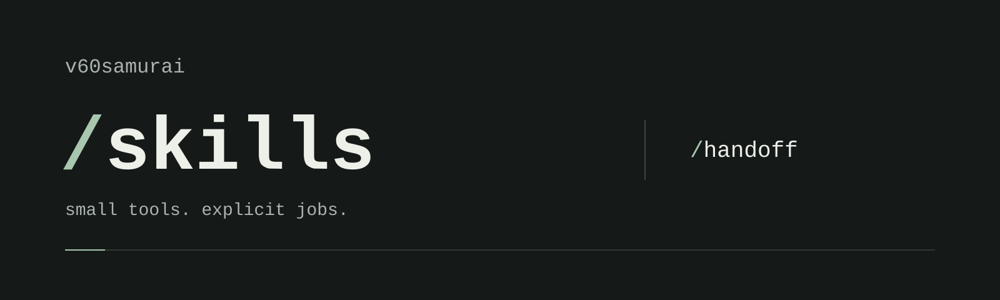

<p align="center">
  
</p>

# Skills

Claude Code skills I wrote and use. Each one does a single job that I was otherwise re-explaining in every session, and none of them plans, routes, or decides what the work means.

## Published

| Skill | What it does | Invocation | Status |
| --- | --- | --- | --- |
| [`handoff`](skills/handoff/SKILL.md) | Compiles meeting notes, threads, specs and updates into a self-contained Markdown evidence packet. Noise goes, material detail stays. A proposal stays a proposal, a disagreement stays visible, and secrets stay out. Inside a Git repository it reads the project's status quo first. | `/handoff` | portable, explicit only |

[`catalog.json`](catalog.json) lists every skill I have written, including the ones that live elsewhere: in their own repositories, or inside a larger system they depend on. Each entry says where the skill lives and why its source is not copied here.

## Principles

- **Smallest sufficient machinery.** A skill is a Markdown file until it needs to be more.
- **One job, one owner.** `/handoff` packages evidence. Whoever receives it decides what the evidence means.
- **Evidence before invention.** A skill reports what the source says and marks what it does not say.
- **One router at most.** These skills never choose a playbook, a milestone, or the next skill.
- **The human moves work between stages.** A skill calls the next one only when the invocation asks for that in words.

## Install

A skill is a directory with a `SKILL.md`. Claude Code loads personal skills from `~/.claude/skills/<name>/`.

```bash
git clone https://github.com/v60samurai/skills.git
ln -s "$PWD/skills/skills/handoff" ~/.claude/skills/handoff
```

Copy the directory instead of linking it if you would rather not track this repository. Then type `/handoff` in Claude Code, followed by the material:

```text
/handoff <paste notes, a thread, or file paths>
/handoff and save it to docs/handoffs/pricing.md <material>
```

`handoff` sets `disable-model-invocation: true`, so it runs only when you type it.

## How `/handoff` works

`/handoff` is an evidence compiler, not a summarizer. It removes noise without removing material context: repetition and chatter collapse, and every distinct requirement, roadmap phase, implementation step, contract, dependency and open question stays.

- **Adaptive depth.** The skill picks the depth from how much unique material the source holds, not from its length. Small: one update or decision, shorter than a screen. Standard: a normal project handoff. Deep: several product areas, architecture, a roadmap or an implementation sequence, which can run to several thousand words.
- **Self-containment.** The receiver should not need to reopen the source. References supplement the handoff and never stand in for content. If the source points at material that was not supplied, the handoff says so and ends with `Ready for Build Flow: NO`.
- **Status quo first.** Inside a Git repository the skill does a bounded, read-only pass before writing: branch, revision, working tree, project documents, and the code on the surfaces the source touches. The handoff then opens with `Repository status quo` and reports the source as a delta: what already exists, what is new, what conflicts. What the code does is evidence, not approval. Outside a repository it works from the source alone.

For a new project handoff, start from a clean default branch:

```bash
cd <project>
git status
claude
```

```text
/handoff <material>
```

Review the handoff, then run the Build Flow with it. `/handoff` stops after printing unless the invocation asks for the chain ("/handoff and run Build Flow"), and Build Flow still does its own reconciliation against the repository either way.

## Structure

```text
skills/<name>/SKILL.md   one directory per published skill
catalog.json             every first-party skill and where it lives
tests/handoff/           source fixtures, repository fixtures, property checks, and a runner
assets/                  banner
```

`node tests/handoff/run.mjs` runs each fixture through `/handoff` with `claude -p` and checks properties of the result: an exact value survived, a proposal was not promoted to a decision, every roadmap phase kept its own entry, a repetitive transcript came out shorter than a dense spec, no secret leaked, nothing was written unless asked, and Git state was left untouched.

## Attribution

The source in this repository is original work under the [MIT license](LICENSE). Skills adapted from someone else's work are credited in `catalog.json` and their source is not republished here. The banner was designed by Codex.
